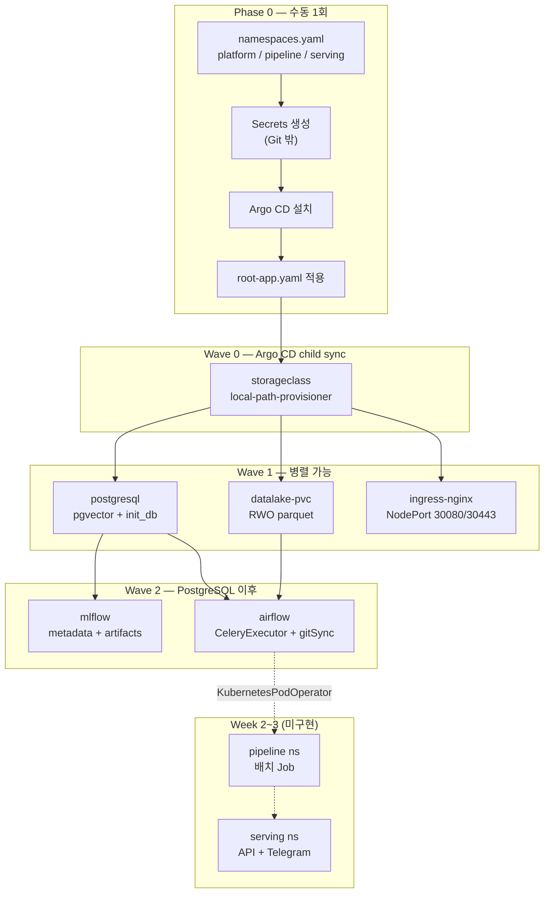

# Kubernetes Infrastructure

Market Layer Platform의 Kubernetes 인프라와 GitOps 배포 구성을 관리한다.

- Argo CD app-of-apps 기반 배포
- 워크로드 생명주기에 따라 `platform`, `pipeline`, `serving` 계층으로 분리
- local-path 기반 영속 스토리지와 parquet data lake 사용
- ingress-nginx NodePort로 클러스터 진입점 제공

## 아키텍처



위 흐름도는 현재 구현된 `platform` 계층의 배포 의존성을 나타낸다. `root-app`(automated)이 child
Application **CR을 sync wave 순서로 생성**한다. 단 child는 **manual sync**라, 실제 워크로드 배포는
**운영자가 같은 순서로 직접 sync**할 때 일어난다(자동 순차 배포 아님). 아래는 "CR 생성 순서 =
권장 수동 sync 순서"다.

1. phase 0: `platform`, `pipeline`, `serving` namespace 생성
2. wave 0: local-path StorageClass
3. wave 1: PostgreSQL, data lake PVC, ingress-nginx
4. wave 2: MLflow, Airflow

MLflow와 Airflow는 PostgreSQL을 사용한다. Airflow worker는 Bronze/Silver parquet 저장을 위해
`datalake-pvc`를 `/opt/airflow/data`에 마운트한다.

## 워크로드 계층

```text
platform orchestration → pipeline processing → serving delivery
```

| 계층 | Namespace | 역할 | 상태 |
|---|---|---|---|
| `platform` | `platform` | PostgreSQL, data lake, MLflow, Airflow 등 공통 기반 | 구현됨 |
| `pipeline` | `pipeline` | Bronze/Silver/Gold 변환, 모델 학습, Feast materialize Job | namespace 준비됨 |
| `serving` | `serving` | 추론 API, brief 생성, Telegram 전달 | namespace 준비됨 |

Airflow 본체는 `platform`에 배포된다. 현재 Bronze v1 태스크는 `platform` namespace의 Airflow
Celery worker에서 실행한다. 이후 KubernetesPodOperator 또는 별도 Job으로 배치 작업을 분리할 때
`pipeline` namespace에 Pod/Job을 생성한다. 생성된 feature와 모델은 `serving` 워크로드가 사용한다.

## 구성 요소

| 구성 요소 | Namespace | 역할 |
|---|---|---|
| local-path-provisioner | `local-path-storage` | 노드 로컬 디스크 기반 PVC 프로비저닝 |
| ingress-nginx | `ingress-nginx` | HTTP/HTTPS NodePort 진입점 |
| PostgreSQL | `platform` | metadata, online store, vector 데이터 저장 |
| Data Lake | `platform` | Bronze/Silver parquet 저장 |
| MLflow | `platform` | 실험 추적 및 artifact 관리 |
| Airflow | `platform` | 데이터 파이프라인 스케줄링과 실행 |
| Argo CD | `argocd` | Git 선언과 클러스터 상태 동기화 |

## 노드 배치와 스토리지 정책

현재 인프라는 단순성과 데이터 위치 예측 가능성을 우선한다. PostgreSQL만 명시적으로 data 노드에
고정하고, 나머지 stateful 워크로드는 `local-path` PVC의 node affinity에 맡긴다.

| 워크로드 | 노드 배치 | 이유 |
|---|---|---|
| PostgreSQL | `nodeSelector: node-role=data` | DB 데이터를 data 노드에 고정 |
| MLflow | nodeSelector 없음 | artifact PVC(`local-path`)가 볼륨 노드로 Pod를 핀 |
| Airflow | nodeSelector 없음 | worker가 `datalake-pvc`를 마운트하며 RWO 제약으로 worker 1개 전제 |
| ingress-nginx | nodeSelector 없음 | NodePort라 어느 노드 IP로도 접근 가능 |

영속 데이터는 `local-path` 기반 PVC에 저장된다. `local-path`는 노드 로컬 디스크이므로 자동 복제나
노드 장애 시 자동 failover를 제공하지 않는다.

| PVC | Namespace | 용도 | 크기 | 접근/스토리지 |
|---|---|---|---|---|
| `postgres-data-postgresql-0` | `platform` | PostgreSQL 데이터 | 10Gi | RWO / `local-path` / Retain |
| `datalake-pvc` | `platform` | Bronze/Silver parquet lake | 20Gi | RWO / `local-path` / Retain |
| `mlflow-artifacts-pvc` | `platform` | MLflow artifact store | 20Gi | RWO / `local-path` / Retain |
| `logs-airflow-worker-0` | `platform` | Airflow worker logs | 100Gi | chart persistence |
| `logs-airflow-triggerer-0` | `platform` | Airflow triggerer logs | 100Gi | chart persistence |
| `redis-db-airflow-redis-0` | `platform` | Airflow Celery broker Redis | 1Gi | chart persistence |

`datalake-pvc`는 `platform` namespace에 있는 RWO PVC다. 현재 Bronze v1은 같은 namespace의 Airflow
Celery worker에서 실행한다. 이후 `pipeline` namespace의 독립 Job으로 전환하려면 namespace-scoped
PVC와 RWO 제약을 해결해야 한다. 후보는 RWX(NFS), MinIO/S3, 또는 실행 위치/namespace 재설계다.

## 디렉토리 구조

```text
infra/
└── k8s/
    ├── bootstrap/
    │   ├── storageclass/
    │   └── ingress-nginx/
    ├── apps/
    │   ├── README.md
    │   ├── platform/
    │   │   ├── postgresql/
    │   │   ├── datalake/
    │   │   ├── mlflow/
    │   │   └── airflow/
    │   ├── pipeline/
    │   └── serving/
    ├── argocd/
    │   ├── root-app.yaml
    │   └── applications/
    └── namespaces.yaml
```

## 부트스트랩 개요

### 1. 도구 준비

- Kubernetes 클러스터
- `kubectl`
- Helm 3
- Git 저장소에 접근 가능한 Argo CD

### 2. Namespace 생성

워크로드 계층의 namespace와 lifecycle label을 생성한다.

```sh
kubectl apply -f infra/k8s/namespaces.yaml
kubectl get namespace platform pipeline serving --show-labels
```

`namespaces.yaml`이 `platform`, `pipeline`, `serving` namespace의 단일 정의다.

### 3. Secret 생성

PostgreSQL, MLflow, Airflow 및 외부 데이터 API에 필요한 Secret을 먼저 생성한다. Secret 값은
Git에 저장하지 않는다.

필요한 Secret 이름과 key는 각 애플리케이션 README를 참고한다.

### 4. Argo CD 설치

```sh
kubectl create namespace argocd --dry-run=client -o yaml | kubectl apply -f -
kubectl apply -n argocd \
  -f https://raw.githubusercontent.com/argoproj/argo-cd/stable/manifests/install.yaml
```

### 5. Root Application 적용

```sh
kubectl apply -f infra/k8s/argocd/root-app.yaml
kubectl -n argocd get applications
```

Application을 sync wave 순서로 동기화한 뒤 상태를 확인한다.

```sh
kubectl -n argocd get applications
kubectl get pods,pvc -A
```

Argo CD 없이 직접 배포하려면 [bootstrap 가이드](./k8s/bootstrap/README.md)에 따라 StorageClass와
ingress-nginx를 먼저 설치한다. 이후 `platform` 계층의 PostgreSQL/data lake, MLflow/Airflow
순서로 배포한다.

`pipeline`과 `serving`은 해당 워크로드가 구현되는 시점에 namespace, RBAC, Deployment/Job 및
Argo CD Application을 추가한다. namespace는 `namespaces.yaml`을 통해 미리 준비한다.

## 서비스 접근

| 서비스 | 접근 방법 |
|---|---|
| ingress-nginx HTTP | `http://<node-ip>:30080` |
| ingress-nginx HTTPS | `https://<node-ip>:30443` |
| Airflow API/UI | `kubectl -n platform port-forward svc/airflow-api-server 8082:8080` |
| MLflow UI | `kubectl -n platform port-forward svc/mlflow 5000:5000` |
| PostgreSQL | `postgresql.platform.svc.cluster.local:5432` |

## 세부 문서

- [Kubernetes Bootstrap](./k8s/bootstrap/README.md)
- [Argo CD Applications](./k8s/argocd/applications/README.md)
- [애플리케이션 계층 구조](./k8s/apps/README.md)
- [PostgreSQL with pgvector](./k8s/apps/platform/postgresql/README.md)
- [Parquet Data Lake](./k8s/apps/platform/datalake/README.md)
- [MLflow Tracking Server](./k8s/apps/platform/mlflow/README.md)
- [Apache Airflow](./k8s/apps/platform/airflow/README.md)
- [Pipeline 계층](./k8s/apps/pipeline/README.md)
- [Serving 계층](./k8s/apps/serving/README.md)

## 운영 제약

- local-path 볼륨은 특정 노드의 로컬 디스크에 종속되며 자동 복제되지 않는다.
- stateful PV는 데이터 보호를 위해 `Retain` 정책을 사용한다.
- `datalake-pvc`는 RWO이므로 Airflow worker replica는 1개를 전제로 한다.
- `pipeline` Job의 data lake 접근은 RWO와 namespace-scoped PVC 제약을 고려해 별도 설계해야 한다.
- Secret과 운영 자격증명은 Git 외부에서 관리한다.
